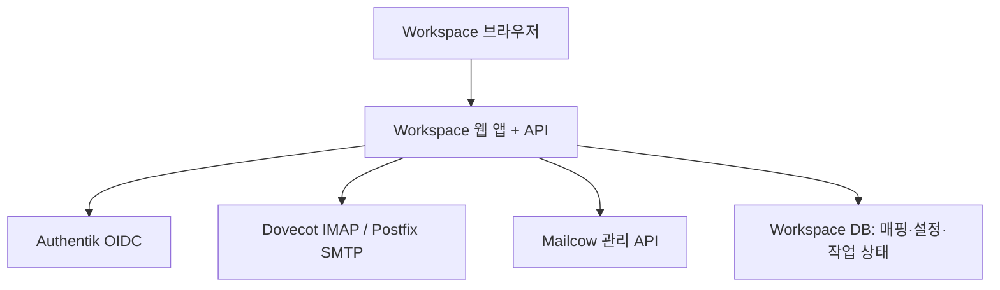

# Dyhs Workspace 프로젝트 기획안 · Codex 개발 지시서

> v1.0 · 2026-09-24 · 참조: `DYHS_Workspace_Design_System.md`, 첨부 메일 화면, 기존 dyhs.kr 디자인 시스템

## 1. 목표와 범위

MAKE;가 운영하는 Dyhs Auth(Authentik), Dyhs Mail(mailcow), Dyhs URL(Kutt)을 하나의 작업 공간으로 제공한다. 사용자는 Workspace에서 메일 읽기·쓰기와 본인 설정을 수행하고, 관리자는 권한 범위 안에서 사용자와 메일 계정을 관리한다. 첫 공개 목표는 **SSO + 안정적인 웹메일 + 계정·메일 설정 진입점**이다. 캘린더·주소록·URL 내부 통합과 통합 프로비저닝은 후속 단계로 분리한다.

Mailcow의 Postfix/Dovecot/Rspamd와 기존 SOGo는 초기에는 유지한다. 별도 Workspace 웹 앱을 구축하고 제한된 사용자로 먼저 사용한다. 기존 메일 서비스의 데이터와 인증을 임의로 변경하지 않는다.

## 2. 가장 먼저 검증할 제약

**OIDC 로그인 자체는 IMAP 자격 증명을 제공하지 않는다.** Authentik 세션을 Dovecot 메일함 접근에 어떻게 연결할지 검증하기 전에는 실제 메일 기능을 완성했다고 선언하지 않는다. 사용자 비밀번호, IMAP 마스터 계정, Mailcow 관리자 API 키를 브라우저·로그·로컬 저장소에 제공하지 않는다. 현재 Mailcow와 Authentik 배포 버전에서 지원하는 위임 인증/OAuth2 또는 서버 측 메일 접근 방식을 조사하고, 최소 권한·사용자별 격리·폐기·감사 방식을 명세한다. 지원되지 않으면 읽기 전용 데모 단계에서 멈추고 연동 방식을 결정받는다.

Authentik `sub`를 불변 외부 식별자로 저장하고 메일 주소와의 매핑은 서버에서 검증한다. 이메일 주소가 같다는 이유만으로 다른 메일함에 접근하게 하지 않는다. Mailcow API가 웹메일 메시지 API를 대체한다고 가정하지 않는다. 서명·자동응답·필터·별칭·패스키 변경은 각각 실제 지원 API와 권한을 확인한 뒤 구현한다.

## 3. 구조

브라우저에는 HttpOnly/Secure/SameSite 세션 쿠키만 제공한다. OIDC Authorization Code + PKCE, state/nonce, 엄격한 redirect URI, 로그아웃·세션 만료를 구현한다. API는 모든 요청에서 서버 측 사용자와 권한을 확인한다. 외부에서 접근하는 경로는 Cloudflare Tunnel의 HTTPS 도메인을 사용하고, 내부 컨테이너 간 경로는 별도 네트워크·최소 권한으로 제한한다. Tunnel은 애플리케이션 인증을 대체하지 않는다.

기술 기준안: TypeScript React/Next.js UI, 별도 API(예: FastAPI), PostgreSQL, 서버 측 IMAP/SMTP 어댑터, Docker Compose 추가 파일. 기존 mailcow 공식 Compose를 직접 수정하지 않는다. 기존 배포·네트워크·버전에 맞춰 구현 전 선택을 기록한다.

## 4. 정보 구조와 역할

| 역할 | 가능 작업 |
| --- | --- |
| 일반 사용자 | 자신의 메일함·개인 설정, 본인에게 허용된 별칭 확인 |
| 메일 운영자 | 명시된 도메인의 메일함·별칭·쿼터 관리 |
| 플랫폼 관리자 | 사용자 연결, 권한·프로비저닝과 감사 확인 |

기본 거부. Authentik 그룹명을 그대로 신뢰하지 말고 서버 측 역할 매핑 및 권한 범위를 설정한다. 다른 사용자 메일함, 전체 도메인, 권한 부여 작업은 관리자 API에서도 별도로 확인한다. 관리 UI와 서버 권한을 동시에 테스트한다.

탐색: 홈 / 메일 / 개인 설정 / 관리(권한 있을 때). 캘린더·주소록·URL은 실제 통합 이전에 완성된 앱처럼 표시하지 않는다. 기존 Dyhs URL은 필요하면 명확한 외부 링크로 연결한다.

## 5. 개발 단계와 완료 조건

### 0. 현황 파악과 설계 기록

현재 mailcow·Authentik 버전, OIDC 클레임, 사용자 생성 방식, Mailcow의 SSO 연동, IMAP/SMTP 인증, SOGo 사용 범위, 기존 Cloudflare Tunnel 경로, 로고 파일을 **읽기 전용**으로 조사한다. 비밀 값은 마스킹한다. 지원 기능·확인되지 않은 기능을 구별한 `docs/integration-decisions.md`, 환경 변수 예시, 위협 모델을 작성한다. 운영 서버 자격 증명과 기존 저장소를 제공받기 전에는 목업으로 진행한다.

### 1. UI 셸과 목업

제공된 디자인 시스템과 이미지로 반응형 셸, 3열 메일, 작성 창, 홈, 개인 설정, 관리자 셸을 구현한다. 목업 데이터는 확실히 표시하고 실제 전송·삭제 버튼을 연결하지 않는다. 320px, 태블릿, 데스크톱에서 메일 선택·뒤로 가기·키보드 조작을 확인한다.

### 2. 인증과 사용자 연결

Authentik OIDC 로그인, 서버 세션, 로그아웃, 역할 매핑, 메일함 연결 검증을 구현한다. 연결되지 않은 계정은 타인의 메일함을 보여주지 않고 지원 요청 상태를 표시한다. `sub` 변경/주소 변경/중복 연결 사례를 테스트한다.

### 3. 메일 읽기

메일 접근 방식이 검증된 후 폴더, 페이지 단위 목록, 메시지 상세, 첨부 다운로드, 읽음 상태를 구현한다. 메시지 ID는 폴더명 + UIDVALIDITY + UID의 수명 규칙을 고려하고, 메일 본문 HTML을 안전하게 격리·정화하며 원격 이미지를 기본 차단한다. MIME 인코딩과 한국어 파일명을 실제 샘플로 검증한다.

### 4. 메일 쓰기

쓰기·답장·전체 답장·전달·첨부·임시보관·SMTP 발송·보낸편지함 반영을 구현한다. 전송 실패와 재시도에서 중복 전송을 피하고, SMTP 수락과 Sent 저장의 부분 실패를 사용자에게 정확히 알린다. 보내는 주소는 서버 측에서 허용된 본인 주소/별칭으로 제한한다. CSRF, 첨부 크기·유형·용량, rate limit을 적용한다.

### 5. 설정과 관리

지원 API가 확인된 설정부터 연결한다. 비밀번호·패스키는 Authentik의 공식 사용자용 흐름으로 안전하게 이동시키고, 관리 토큰으로 임의 변경하지 않는다. Mailcow 관리 API는 서버에서만 사용하고 가능한 범위에서 읽기·쓰기 키와 도메인 범위를 분리한다. 사용자 생성은 Authentik과 Mailcow 간 분산 작업으로 취급하며 부분 성공을 기록, 재시도와 수동 복구를 제공한다. 메일함 삭제는 명시 확인·백업·운영 승인 후 별도 배포 단계로 둔다.

### 6. 제한 공개 및 이행

테스트 도메인·테스트 계정으로 E2E 수행 후 일부 사용자에게만 Workspace를 노출한다. 기존 SOGo 접근 경로를 유지하고, 기능 격차·장애 대응·되돌리기 절차를 문서화한다. `mail.dyhs.kr` 전환이나 `SKIP_SOGO` 변경은 검증 결과를 제시한 뒤 별도 운영 변경으로 실행한다. 기존 Kutt 데이터 마이그레이션은 이 프로젝트와 독립된 작업으로 취급한다.

## 6. 제안 API 계약

| 경로 | 기능 | 권한 |
| --- | --- | --- |
| `GET /api/me` | 사용자·연결 메일함·역할·기능 플래그 | 로그인 |
| `GET /api/mail/folders` | 본인 폴더와 개수 | 메일 사용자 |
| `GET /api/mail/messages?folder=&cursor=` | 페이지 목록 | 메일 사용자 |
| `GET /api/mail/messages/{id}` | 본문·헤더·첨부 메타 | 메일 사용자 |
| `POST /api/mail/messages/{id}/actions` | 읽음·이동·삭제 등 | 메일 사용자 |
| `POST /api/mail/send` | 서버 측 발신 검증 후 전송 | 메일 사용자 |
| `GET /api/settings/mail` | 실제 지원 설정·읽기 전용 상태 | 로그인 |
| `/api/admin/*` | 운영 범위별 사용자·메일함·별칭 | 서버 측 관리자 권한 |

폴더·메시지 ID를 클라이언트가 임의 조합해 다른 계정에 접근할 수 없게 한다. 목록의 정렬·검색·페이징은 서버에서 처리한다. API 응답의 개인정보·메일 내용은 캐시와 로그에 기록하지 않는다. OpenAPI 스키마와 오류 코드·권한 오류 예시를 함께 제공한다.

## 7. Codex 실행 지시문

> 이 문서와 `DYHS_Workspace_Design_System.md`, 첨부 화면을 기준으로 Dyhs Workspace를 단계적으로 구현하라. 우선 리포지토리와 배포 구성을 조사하고 단계 0 결정 기록을 작성하라. 실제 서비스 버전이나 인증 연결을 확인할 수 없다면 가정을 명시하고 단계 1 목업까지 구현하라. Authentik OIDC와 Mailcow IMAP 사이의 사용자별 안전한 연결 방법이 검증되기 전에는 운영 메일 접근 코드를 배포하지 말라. 기존 mailcow compose·메일 데이터·SOGo 설정을 수정하거나 운영 자격 증명을 커밋하지 말라. 각 단계별로 실행 방법, 필요한 환경 변수, 검증 결과와 미해결 항목을 보고하라. 화면은 제공된 MAKE; 로고, 브랜드 색, Pretendard, 메일 3열 배치와 모바일 전환을 따른다. 실제 데이터 기능은 mock과 명확히 분리하라.

예상 디렉터리: `apps/web`, `apps/api`, `packages/design-tokens`, `infra/compose`, `docs`, `tests`. 실제 저장소 구조가 있으면 그 관례를 따른다. `.env.example`에는 변수 이름과 설명만 넣는다. 개발 데이터는 허구의 사용자·도메인으로 만들고 실제 메일 주소를 테스트 픽스처에 쓰지 않는다.

## 8. 검증 체크리스트

- [ ] 다른 사용자의 메일함·첨부·별칭·관리 API에 접근할 수 없다.
- [ ] OIDC 재로그인, 세션 만료, 로그아웃과 CSRF 차단이 정상 작동한다.
- [ ] 한글 제목·본문·첨부, HTML 메일, 원격 이미지 차단이 확인된다.
- [ ] SMTP 실패·재시도·Sent 저장 실패가 정확히 표시된다.
- [ ] 사용자 생성 부분 실패를 탐지하고 재시도·복구할 수 있다.
- [ ] 320px부터 데스크톱까지 읽기·쓰기·설정이 가능하고 키보드·대비가 검증된다.
- [ ] 기존 SOGo와 Mailcow 운영에 영향 없이 제한 공개와 되돌리기가 가능하다.
