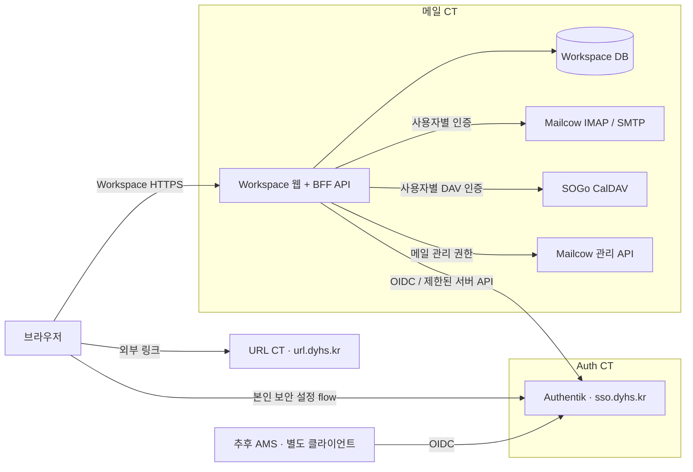

# 배포 및 계정 관리 확장

2026-09-25 갱신: 공개 주소는 `https://workspace.dyhs.kr`, Tunnel은 각 CT 호스트에서 실행합니다. 최신 구현/설치는 [Live 설치](live-installation.md) 참조. 아래에는 아직 구현하지 않은 CalDAV·초대·앱 관리 목표도 포함되어 있습니다.

2026-09-24 사용자 지시 반영. 이 문서의 CT 배치는 확정된 운영 방향이며, 내부 IP·포트·버전·권한·Workspace 도메인은 아직 확인되지 않았습니다. 새 화면은 입력/검토 목업이고 실제 변경 API를 호출하지 않습니다.

현재 정적 미리보기의 실행 명령과 업데이트·복구 절차는 [설치 매뉴얼](installation.md)에 정리했습니다. 아래 BFF/API/DB 구성은 실제 연동 단계의 목표입니다.

## CT 배치

| 위치 | 공개 서비스 | 책임 |
| --- | --- | --- |
| 메일 CT | `https://mail.dyhs.kr` | Dockerized Mailcow의 메일 및 SOGo CalDAV, 기존 SOGo 유지 |
| 메일 CT 내 별도 Workspace 서비스 | 공개 주소 미정 | Workspace 웹/BFF API, 사용자 연결·설정·작업 상태 DB |
| Auth CT | `https://sso.dyhs.kr` | Authentik 계정·그룹·인증 수단·OIDC Provider의 원본 |
| URL CT | `https://url.dyhs.kr` | 기존 Dyhs URL 서비스. 데이터/배포 이전 없음 |
| 추후 AMS | 주소·배치 미정 | MAKE; 동아리실 출입 시스템과 별도 OIDC 클라이언트 |

메일 CT와 Auth/URL CT가 분리되어 있으므로 Docker 서비스 이름이나 localhost로 다른 CT에 연결할 수 있다고 가정하지 않습니다. 서버 간 HTTPS 또는 검증된 사설망 경로를 운영 구성으로 지정합니다. 브라우저 요청은 Workspace BFF를 거쳐 처리하고 API 토큰이나 다른 서비스의 세션 쿠키를 브라우저에 전달하지 않습니다.

Workspace는 Mailcow 공식 Compose와 **별도 Compose 프로젝트·이미지·볼륨**으로 배치합니다. 기존 80/443/IMAP/SMTP 포트를 점유하거나 Mailcow 컨테이너·Docker 소켓·메일 볼륨을 마운트하지 않습니다. 별도의 내부 HTTP 포트를 로컬 reverse proxy/Tunnel origin에 연결합니다. CT 안에 함께 있어도 네트워크 접근과 메일함 권한은 별도로 확인합니다. 리소스 한도와 로그 용량을 지정해 웹 앱 장애가 메일 서비스를 고갈시키지 않도록 합니다.

정적 목업은 `dist/`로 빌드 가능하며 `infra/compose/compose.preview.yaml`에 독립 미리보기 컨테이너를 추가했습니다. 비루트 Nginx, 읽기 전용 파일시스템, loopback 3080 포트, 리소스·로그 제한을 사용하고 기존 Mailcow 자원을 마운트하지 않습니다. `/api`는 미구현 503 응답입니다. 기반 이미지의 기본 동작은 [공식 비루트 Nginx 이미지](https://github.com/nginx/docker-nginx-unprivileged)를 참고했습니다. 운영에는 배포하지 않았으며 API/DB/운영 네트워크는 내부 주소와 Workspace 공개 주소를 받은 뒤 추가합니다.

## 캘린더

일정의 원본은 Mailcow에 포함된 **SOGo CalDAV**로 결정합니다. 별도 캘린더 서버나 독립 일정 DB를 만들지 않습니다. [Mailcow 공식 클라이언트 안내](https://docs.mailcow.email/client/client-thunderbird/)

Workspace 서버가 인증된 사용자의 DAV principal과 calendar-home-set을 탐색하고, 허용된 calendar collection만 노출하는 방식으로 구현합니다. 메일 주소로 DAV URL을 임의 조합해 다른 사용자의 캘린더를 선택하지 않습니다. 최초에는 읽기부터 연결하고 이후 ETag/If-Match 충돌 처리, iCalendar UID/반복 일정/시간대, sync-token 또는 지원되는 동기화 방식을 검증합니다. 사용자 입력 DAV URL로 서버가 임의 주소에 요청하지 못하도록 서버 endpoint를 고정합니다.

OIDC 세션이 DAV 자격 증명을 자동 제공하지는 않습니다. IMAP과 별개로 현재 SOGo의 사용자별 앱 비밀번호/위임 인증 가능 여부를 확인합니다. Workspace가 제공할 사용자별 비밀 보관 방식은 아직 미결정입니다. 캘린더 메뉴는 연결 전까지 준비 중으로 유지합니다. 주소록의 CardDAV 연결 여부는 별도 검증 항목입니다.

## 개인 계정 설정

Workspace의 **계정 및 보안**은 다음 세 가지에 집중합니다. 일반 화면 테마·메일 설정·저장 공간 탭은 별도 기능입니다.

| 빠른 작업 | 목표 UX | 실행 경계 |
| --- | --- | --- |
| 패스키 | 등록 상태 확인, 추가·이름 변경·제거 진입 | Authentik WebAuthn의 검증된 RP ID/origin 및 본인 인증 flow 사용 |
| 2FA | 등록 상태, 인증 앱 등록·해제, 복구 수단 안내 | 본인 flow와 재인증, 정책상 필수 MFA 우회 금지 |
| 비밀번호 | 본인 확인 후 변경 | 관리 토큰으로 타인/본인 비밀번호를 강제 재설정하는 API와 분리 |
| 고급 설정 | Authentik으로 이동 | 프로필, 세션·연결 앱 및 나머지 기능 |

빠른 작업 버튼과 상태 영역은 현재 UI에 반영했지만 사용자 세션/설정 flow를 연결하기 전까지 비활성입니다. 등록 상태 미확인을 “미등록”이나 “2FA 꺼짐”으로 표시하지 않습니다. 고급 설정은 [사용자 설정 공식 경로](https://docs.goauthentik.io/users-sources/user/account-types/internal-users/)를 사용한 `https://sso.dyhs.kr/if/user/#/settings` 외부 링크입니다. 해당 인스턴스에서의 로그인·권한·기능 동작은 미검증이며, 실제 계정에 별도로 로그인합니다.

패스키는 RP ID와 origin 조건을 만족해야 합니다. `sso.dyhs.kr`의 패스키를 다른 Workspace origin에서 직접 등록할 수 있다고 가정하지 않습니다. [WebAuthn 생성 옵션의 RP 규칙](https://developer.mozilla.org/en-US/docs/Web/API/PublicKeyCredentialCreationOptions#rp), [Authentik WebAuthn stage](https://docs.goauthentik.io/add-secure-apps/flows-stages/stages/authenticator_webauthn/)

따라서 초기 구현은 Workspace에서 작업을 선택하고 필요한 인증/등록 과정만 sso.dyhs.kr의 해당 flow에서 완료한 뒤 돌아오도록 합니다. 화면 내 직접 처리 가능한 항목은 현재 배포의 사용자용 API와 권한을 검증한 경우에만 추가합니다. 공통 상위 도메인으로 RP를 변경하거나 Authentik 전체를 임의로 프록시하지 않습니다. 비밀번호·2FA 시드를 목업 UI에서 입력받지 않습니다.

## 간편 Authentik 관리

사용자·그룹·초대 링크·애플리케이션 탭과 생성 전 검토 화면을 추가했습니다. 현재 예시만 사용하며 사용자 생성, 초대 URL 발급, Client Secret 생성 및 권한 변경은 일어나지 않습니다.

| 업무 | 공식 Authentik API 후보(`/api/v3` 아래) | 간편 화면 / 서버 제한 |
| --- | --- | --- |
| 사용자 관리 | `core/users/`, 해당 사용자 조회/변경 | 이름·ID·이메일·활성 상태·허용 그룹. 관리자/서비스 계정과 소유 범위 밖 사용자는 제외 |
| 그룹 관리 | `core/groups/`, `add_user` / `remove_user` | 일반 그룹·구성원만. superuser 그룹, 상위 그룹, 권한 부여는 별도 고급 관리 |
| 초대 발급/폐기 | `stages/invitation/invitations/` | 일회용, 24시간 기본 만료, 최대 7일, 검증된 enrollment flow, 허용된 초기 그룹 |
| 앱 등록 | `providers/oauth2/` + `core/applications/` | OAuth 2.0/OIDC, public/confidential, 정확한 HTTPS callback, 승인된 flow·서명 키·scope 템플릿 |

공식 근거: [사용자](https://api.goauthentik.io/reference/core-users-create/), [그룹](https://api.goauthentik.io/reference/core-groups-create/), [초대 API](https://api.goauthentik.io/reference/stages-invitation-invitations-create/), [앱 API](https://api.goauthentik.io/reference/core-applications-create/), [OAuth2 Provider API](https://docs.goauthentik.io/docs/developer-docs/api/reference/providers-oauth-2-create). 이들은 API 존재 근거이며 현재 배포의 필드/권한 호환성을 보증하지 않습니다. 구현 시 해당 서버의 `/api/v3/schema/`와 버전을 기준으로 계약을 확인합니다.

서버에 `identity.users.manage`, `identity.groups.manage`, `identity.invitations.manage`, `identity.applications.manage` 권한을 분리합니다. 메일 운영자에게 이 권한이 자동으로 주어지지 않습니다. 브라우저의 메뉴/토글이나 전송된 role 값은 사용하지 않고 서버의 역할 매핑과 대상 객체 범위를 매 요청 확인합니다. Authentik API 자격은 서버 전용으로, 배포 버전이 지원하는 RBAC로 제한합니다. 고권한 API를 그대로 중계하는 범용 프록시는 만들지 않습니다. API 인증 방식은 [공식 API 인증 문서](https://api.goauthentik.io/authentication/)와 실제 배포를 대조합니다.

초대는 받은 이메일과 가입 identity를 enrollment 정책으로 검증하고 그룹/권한을 임의 fixed_data로 주입하지 못하게 합니다. 초대 작성자의 권한이 폐기되어도 이미 발급한 초대가 남을 수 있으므로 초대별 만료/폐기와 발급자 비활성 시 정리 절차가 필요합니다. [Authentik 초대 문서](https://docs.goauthentik.io/users-sources/user/invitations) 자동 초대 이메일 발송은 별도 명시 작업이며 이번 구현에서는 하지 않습니다.

앱 생성은 사전 검증 → Provider 생성 → Application 연결 → 허용 대상 정책 연결 → 최종 활성 순서를 작업 상태로 기록합니다. 초기 접근은 기본 거부이며 “대상 그룹 없음”을 모두 허용으로 해석하지 않습니다. 실패하면 이 작업이 만든 객체만 추적해 재시도/복구하고, 기존 객체를 자동 삭제하지 않습니다. 검증된 API 버전에서 더 강한 트랜잭션 생성 경로가 지원되면 그 경로를 우선 사용합니다. 클라이언트 secret은 서버에서 생성·보관하며 브라우저 localStorage와 감사 로그에 넣지 않습니다.

초대 URL/비밀은 서버 연결 없이 가짜로 생성하지 않습니다. 현재 UI의 콜백 검사도 사용자 편의 검증일 뿐이며 운영 서버에서 별도 HTTPS/host 허용 목록·정확한 redirect URI·CSRF·재인증·rate limit을 적용해야 합니다.

## 추후 AMS 연동

AMS는 Workspace와 별도 OAuth2/OIDC Application/Provider 및 client_id를 갖습니다. Workspace의 client secret이나 세션 쿠키를 공유하지 않습니다. 로그인은 Authorization Code + PKCE와 검증된 redirect URI를 사용합니다. AMS의 사용자 식별자는 해당 클라이언트에서 검증한 `(issuer, sub)`로 연결하고 이메일을 출입 권한 키로 사용하지 않습니다. 서로 다른 Provider의 issuer/sub가 같다는 가정 없이 Authentik의 subject 설정과 중앙 identity 매핑을 검증합니다.

Authentik은 신원과 제한된 그룹/클레임을 제공하며 AMS가 동아리실·역할·시간대별 출입 정책을 판단합니다. SSO 로그인 성공, 초대 수락, MAKE; 그룹 가입 또는 Workspace 관리자 권한이 문 열림을 자동 허용하지 않습니다. 계정 비활성·그룹 탈퇴의 권한 철회 지연, 토큰 수명, 장치 인증과 감사 기록은 AMS 연동 시 별도로 설계합니다. 현재 AMS 앱/계정/출입 정책은 생성하지 않았습니다.

## 연결 전 남은 정보

- Workspace 공개 hostname과 메일 CT의 배포 경로·내부 포트·reverse proxy/Tunnel 구성.
- Authentik/Mailcow/SOGo 실제 버전 및 테스트 계정. 공개 URL만으로 배포 버전을 단정하지 않음.
- Authentik의 본인 설정 flow(slug), OIDC provider issuer와 callback, 제한된 관리 계정/RBAC.
- SOGo CalDAV의 사용자별 인증과 principal 탐색 검증.
- AMS의 공개 주소/콜백/클라이언트 유형/사용자 매핑 정책은 추후 결정.

이번에 확인한 공개 URL은 사용자 제공 정보입니다. 문서 조회 도구로 Auth/Mail의 응답을 확인하지 못했으며 장애라고 판정하지 않았습니다. Dyhs URL 로그인 페이지 응답만 확인했습니다. 비밀이나 운영 설정은 조회/변경하지 않았습니다.
